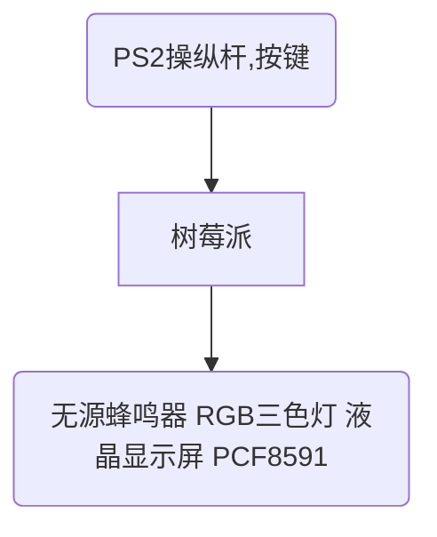
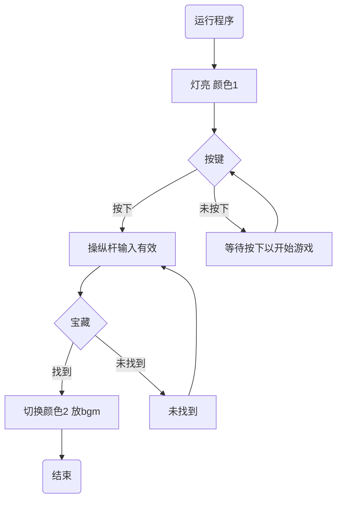
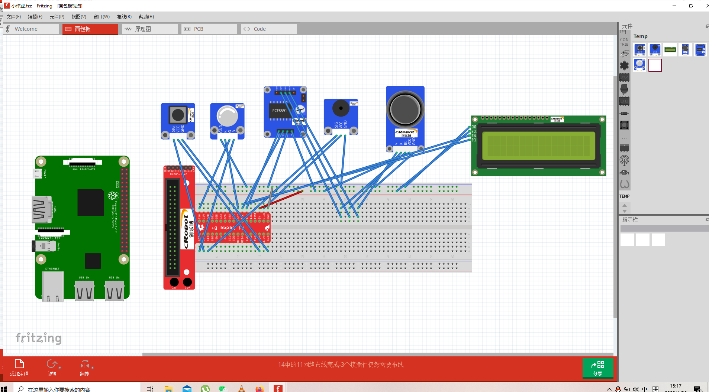
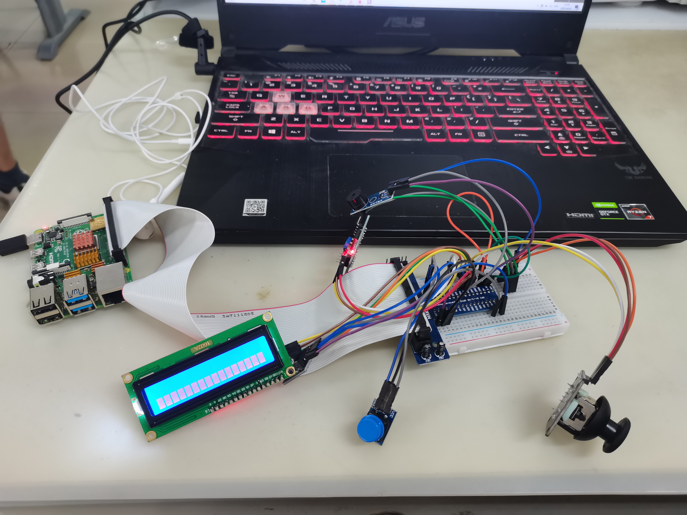

#北京科技大学《电子技术实习》 小作业1
[TOC]

##零，制作人员基本信息
    组号：小组04
    小组成员：zyz
    班级：信安201
    学院：计算机与通信工程学院
    提交日期：2022年4月26日

##一，作业内容介绍
###1.作业类型
    小游戏-找宝藏
###2.使用模块（6个）及其作用说明
    1.PCF8591（模数信号转换）；
    2.RGB三色灯（进入游戏显示颜色1，找到宝藏后显示颜色2）；
    3.按键开关一个（确认是否开始游戏，只有
    当按下按键之后才可以开始游戏，使用操纵杆）；
    4.PS2操纵杆（控制当前人物坐标，实现上下左右移动）；
    5.液晶显示屏（显示当前人物坐标点及其相关信息）；
    6.无源蜂鸣器（在找到宝藏之后播放bgm）；
###3.主要设计思路
    首先需要在源代码里设置地图范围大小（比如5x5大小的地图），然后
    设置宝藏点的位置（比如x=2，y=3为宝藏坐标点），随后就可以进入
    游戏了（运行代码）。按下按键开关后（若不按下则操纵杆无效），
    通过控制PS2操纵杆实现人物的上下左右移动，并通过显示器显示坐
    标及其相关信息，当找到宝藏之后（即当前坐标为宝藏坐标时）RGB
    三色灯会切换颜色，无源蜂鸣器会播放bgm。

##二，硬件框图

##三，程序流程图

##四，作品接线图

##五，实物图展示

##六，作品视频展示
    见外部文件

##七，源代码(pdf中由于篇幅限制，部分代码展示不全，看完整源代码请看外部文件)
###PCF1598代码
@import "PCF8591.py"
###LCD1602代码
@import "LCD1602.py"
###主程序代码
@import "main.py"

##八，总结
    通过此次的实验，我们学会了这些基本模块的基本工作原理以及
    其如何实现他们进行工作的python代码逻辑。在仔细阅读研究
    其python代码之后，基本上就知道了该如何控制其工作；在仔
    细研究其电路接线原理之后，基本上就知道了该如何在面包板
    上进行接线，知道了该如何将几个模块的功能串联起来。综合
    来说，只要耐心阅读代码及其注释以及模块的电路基本工作原
    理，完成小作业1的简单功能并不困难。此次小游戏找宝藏就
    是一个比较简单的代码实现。
